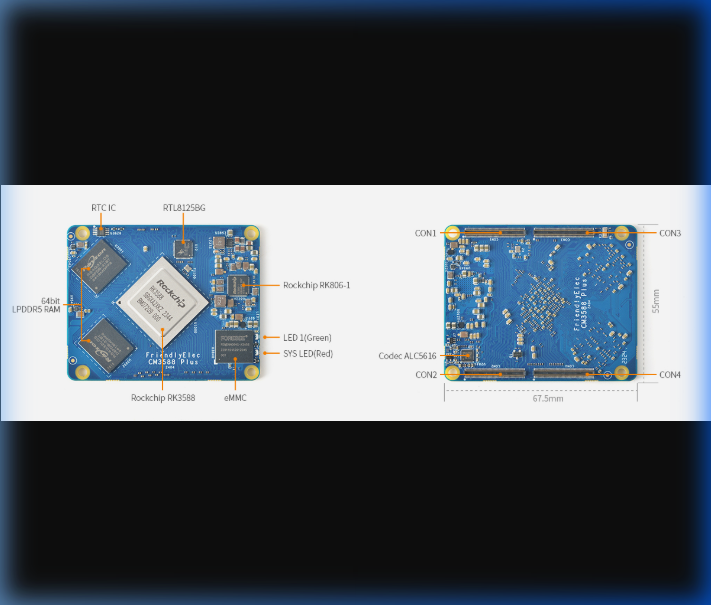

# 
🧬 Lascope Hardware Ecosystem

  
  
  

 

  
<b>High-performance, hardware-accelerated imaging platform for next-generation endoscopy.</b>

  <i>Precision-engineered PCB designs for medical-grade reliability and low-latency throughput.</i>

---

## 📸 Hardware Overview: CM3588 Plus
The core of the Lascope system is the **FriendlyElec CM3588 Plus**, a high-performance SoM (System on Module) powered by the Rockchip RK3588.

  
   
  <i>Fig 1.0: CM3588 Plus Component Mapping (RK3588, LPDDR5 RAM, eMMC, and Peripherals)</i>

---

## 💎 Design Philosophy
The Lascope hardware architecture is built on a **Modular Sub-PCB Model**. By separating the high-speed computing core from the user interface and illumination modules, we ensure:
- **EMC Isolation:** High-speed signals are isolated on the Main Board (Board 1).
- **Serviceability:** Individual modules (Buttons, LEDs, Battery) can be replaced or upgraded independently.
- **Thermal Efficiency:** Optimized heat dissipation paths for the RK3588 SoC.

---

## 📂 Modular Deliverables

### 🖥️ Core Processing Unit
| Board ID | Name | Role | Specs |
| :--- | :--- | :--- | :--- |
| **BOARD 1** | **Main Controller** | System Logic & Vision | RK3588, 64-bit LPDDR5, Dual RTL8125BG |

### 💡 Illumination & Sensors
| Board ID | Name | Role | Key Specs |
| :--- | :--- | :--- | :--- |
| **BOARD 5** | **Camera LED** | Endoscopic Light Source | High-CRI 5700K LEDs |
| **BOARD 6** | **LED Controller** | PWM Dimming Logic | TLC59108 I2C Driver |

### 🔋 Power & Control
| Board ID | Name | Role | Key Specs |
| :--- | :--- | :--- | :--- |
| **BOARD 4** | **Battery BMS** | Power Management | Smart Charging & Fuel Gauge |
| **BOARD 2** | **Button Sub-PCB** | Tactile Interface | 5-Way Navigation Switch |
| **BOARD 3** | **Status Panel** | Visual Feedback | 5-LED Diagnostic Array |
| **BOARD 7** | **Power Logic** | Soft-Start Circuitry | Latching Power Switch |

---

## 🛠️ Production Standards

| Attribute | Specification |
| :--- | :--- |
| **PCB Stackup** | 8-Layer High-Density (Main) / 2-Layer (Sub) |
| **Material** | Isola 370HR / IT-180A (High TG) |
| **Surface Finish** | Lead-Free ENIG (Au: 0.05um, Ni: 3um) |
| **Impedance** | 90Ω Differential (USB), 100Ω (Ethernet) |
| **Certification** | IPC-A-600 Class 2 Compliance |

---

## 📥 Getting Started with Fabrication
1. **Gerber Review:** Open the `.zip` files in each directory using a CAM tool (e.g., CAM350 or Gerbv).
2. **SMT Assembly:** Provide the `PickAndPlace` and `BOM` files to your PCBA partner.
3. **Mechanical Fit:** Use the provided `.step` models to verify enclosure clearances before milling.

---

  Proprietary and Confidential | &copy; 2026 Lascope Medical Imaging Systems

